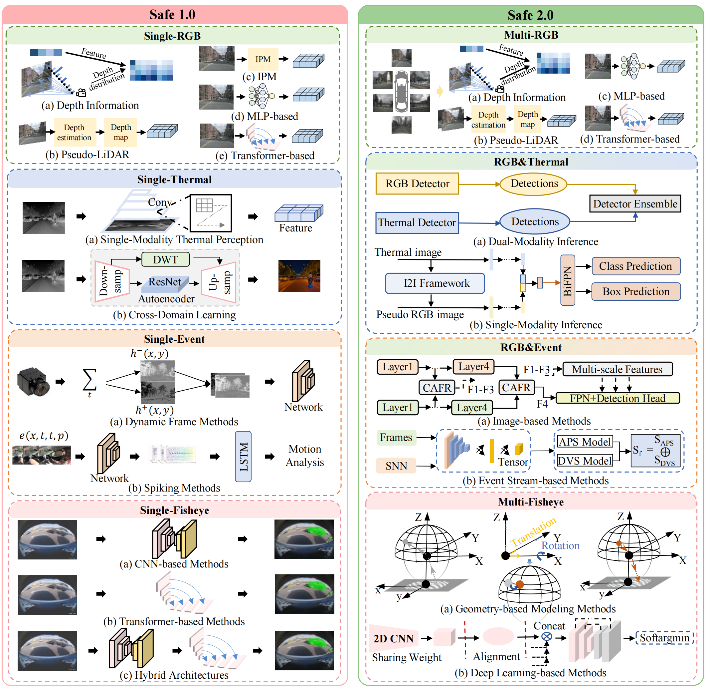

# Safe 1.0: Local Perception 
Single-modal perception focuses on understanding the environment and ensuring driving safety using a single visual sensor. Different modalities provide unique strengths—RGB cameras capture rich semantic information, thermal sensors perform reliably in low-light conditions, event cameras offer high temporal resolution, and fisheye cameras enable wide field-of-view perception.

However, relying on a single modality comes with inherent limitations. Under challenging conditions such as illumination changes, adverse weather, high-speed motion, and geometric distortions, these systems can become unreliable. These are not just performance issues—they represent fundamental constraints that impact safety in real-world, safety-critical scenarios.

Understanding these limitations is crucial for defining the safety boundaries of pure vision-based systems. It also highlights the need to move beyond single-modal perception toward multi-camera and multimodal fusion, enabling more robust, all-weather, and all-time autonomous driving systems.

## RGB
### 2D-to-3D Methods 
#### ``Pseudo-LiDAR'' methods.
* Pseudo-LiDAR from Visual Depth Estimation: Bridging the Gap in 3D Object Detection for Autonomous Driving / [paper](https://arxiv.org/abs/1812.07179) / [project](https://github.com/mileyan/pseudo_lidar/) / CVPR 2019 / Pseudo-LiDAR  
* Are we Missing Confidence in Pseudo-LiDAR Methods for Monocular 3D Object Detection? / [paper](https://arxiv.org/abs/2012.05796) / ECCV 2020
#### Depth distributions methods.
* Categorical Depth Distribution Network for Monocular 3D Object Detection / [paper](https://arxiv.org/abs/2103.01100) / [project](https://github.com/TRAILab/CaDDN/) / CVPR 2021 / CaDDN  
* Unimode: Unified monocular 3d object detection / [paper](https://arxiv.org/html/2402.18573v4) / [project](https://github.com/Lizhuoling/UniMODE/) / CVPR 2024 / Unimode  

### 3D-to-2D Methods
#### IPM-based methods.
* Inverse perspective mapping simplifies optical flow computation and obstacle detection / [paper](https://link.springer.com/article/10.1007/BF00201978) / Biological cybernetics / IPM  
* A geometric approach to obtain a bird's eye view from an image / [paper](https://arxiv.org/abs/1905.02231) / [project](https://github.com/SAmmarAbbas/birds-eye-view/) / ICCV 2019 
* Understanding bird’s-eye view of road semantics using an onboard camera / [paper](https://arxiv.org/abs/2012.03040) / [project](https://github.com/ybarancan/BEV_feat_stitch/) / RAL 2022 

#### MLP-based methods.
* Projecting Your View Attentively: Monocular Road Scene Layout Estimation via Cross-view Transformation / [paper](https://ieeexplore.ieee.org/document/9578824) / [project](https://github.com/JonDoe-297/cross-view/) / ICIPA 2017 / PYVA  
* BEV-LaneDet: a Simple and Effective 3D Lane Detection Baseline / [paper](https://arxiv.org/abs/2210.06006) / [project](https://github.com/AftermathK/cl_bev_lane_det/) / arXiv 2022 / BEV-LaneDet  
#### Transformer-based methods.
* Predicting Semantic Map Representations from Images using Pyramid Occupancy Networks / [paper](https://arxiv.org/abs/2003.13402) / [project](https://github.com/tom-roddick/mono-semantic-maps/) / arXiv 2020 / PON  
* Translating Images into Maps / [paper](https://arxiv.org/abs/2110.00966) / [project](https://github.com/avishkarsaha/translating-images-into-maps/) / ICRA 2022 / TIIM  
* Bird's-Eye-View Panoptic Segmentation Using Monocular Frontal View Images / [paper](https://arxiv.org/abs/2108.03227) / [project](https://github.com/robot-learning-freiburg/PanopticBEV/) / RA-L 2022 / PanopticBEV  

## Thermal
### Single-modality thermal perception
* Analysis of thermal imaging performance under extreme foggy conditions: Applications to autonomous driving / [paper](https://www.mdpi.com/2313-433X/8/11/306) / MDPI 2022
* Autonomous Vehicle Perception Using Monocular Thermal Imaging Cameras / [paper](https://ieeexplore.ieee.org/abstract/document/10919994) / ITSC 2024
### Cross-domain learning
* Exploring thermal images for object detection in underexposure regions for autonomous driving / [paper](https://arxiv.org/pdf/2006.00821) / arXiv 2021
* Sstn: Self-supervised domain adaptation thermal object detection for autonomous driving / [paper](https://arxiv.org/pdf/2103.03150) / RSJ 2021 / SSTN 
* Unimode: Unified monocular 3d object detection / [paper](https://ml4ad.github.io/files/papers2021/Improved%20Object%20Detection%20in%20Thermal%20Imaging%20Through%20Context%20Enhancement%20and%20Information%20Fusion:%20A%20Case%20Study%20in%20Autonomous%20Driving.pdf) / NeurIPS 2021 / CEIFF
 

## Event
### Dynamic frame methods
* Event-based vision meets deep learning on steering prediction for self-driving cars / [paper](https://openaccess.thecvf.com/content_cvpr_2018/papers/Maqueda_Event-Based_Vision_Meets_CVPR_2018_paper.pdf) / [project](https://www.youtube.com/watch?v=_r_bsjkJTHA) / CVPR 2018
* Dual memory aggregation network for event-based object detection with learnable representation / [paper](https://ojs.aaai.org/index.php/AAAI/article/view/25346) / AAAI 2023 / DMANet
* Pseudo-labels for supervised learning on dynamic vision sensor data, applied to object detection under ego-motion / [paper](https://openaccess.thecvf.com/content_cvpr_2018_workshops/papers/w12/Chen_Pseudo-Labels_for_Supervised_CVPR_2018_paper.pdf) / CVPR 2018
* EV-FlowNet: Self-supervised optical flow estimation for event-based cameras / [paper](https://arxiv.org/pdf/1802.06898) / [project](https://daniilidis-group.github.io/mvsec/) / arXiv 2018 / EV-FlowNet
* Esvio: Event-based stereo visual inertial odometry / [paper](https://arxiv.org/pdf/2212.13184) / [project](https://github.com/arclab-hku/ESVIO) / IEEE RA-L 2024 / ESVIO
### Spiking methods
* EDDD: Event-based drowsiness driving detection through facial motion analysis with neuromorphic vision sensor / [paper](https://ieeexplore.ieee.org/abstract/document/8990081/) / JSEN 2020 / EDDD
* Neuromorphic sensing for yawn detection in driver drowsiness / [paper](https://arxiv.org/pdf/2305.028884) / ICMV 2022
* Optimization of event camera bias settings for a neuromorphic driver monitoring system / [paper](https://ieeexplore.ieee.org/document/10453572/?denied=) / IEEE Access 2024

## Fisheyes
### CNN-based methods
* FisheyeYOLO: Object detection on fisheye cameras for autonomous driving / [paper](https://ml4ad.github.io/files/papers2020/FisheyeYOLO:%20Object%20Detection%20on%20Fisheye%20Cameras%20for%20Autonomous%20Driving.pdf) / [project](https://www.youtube.com/watch?v=4GLF4dz5CYc) / NeurIPS 2020 / FisheyeYOLO
* Fisheyedistancenet: Self-supervised scale-aware distance estimation using monocular fisheye camera for autonomous driving / [paper](https://arxiv.org/pdf/1910.04076) / [project](https://www.youtube.com/watch?v=Sgq1WzoOmXg) / ICRA 2020 / FisheyeDistanceNet
* Adaptable deformable convolutions for semantic segmentation of fisheye images in autonomous driving systems / [paper](https://arxiv.org/pdf/2102.10191) / arXiv 2019
* Fisheyemodnet: Moving object detection on surround-view cameras for autonomous driving / [paper](https://arxiv.org/pdf/1908.11789) / arXiv 2019 / FisheyeMODNet
### Transformer-based methods
* FishDreamer: Towards fisheye semantic completion via unified image outpainting and segmentation / [paper](https://arxiv.org/pdf/2303.13842) / arXiv 2023 / FishDreamer
### Hybrid architectures
* Lightweight fisheye object detection network with transformer-based feature enhancement for autonomous driving / [paper](https://ieeexplore.ieee.org/abstract/document/10802087/) / IROS 2024
* Syndistnet: Self-supervised monocular fisheye camera distance estimation synergized with semantic segmentation for autonomous driving / [paper](https://openaccess.thecvf.com/content/WACV2021/papers/Kumar_SynDistNet_Self-Supervised_Monocular_Fisheye_Camera_Distance_Estimation_Synergized_With_Semantic_WACV_2021_paper.pdf) / WACV 2021 / SynDistNet