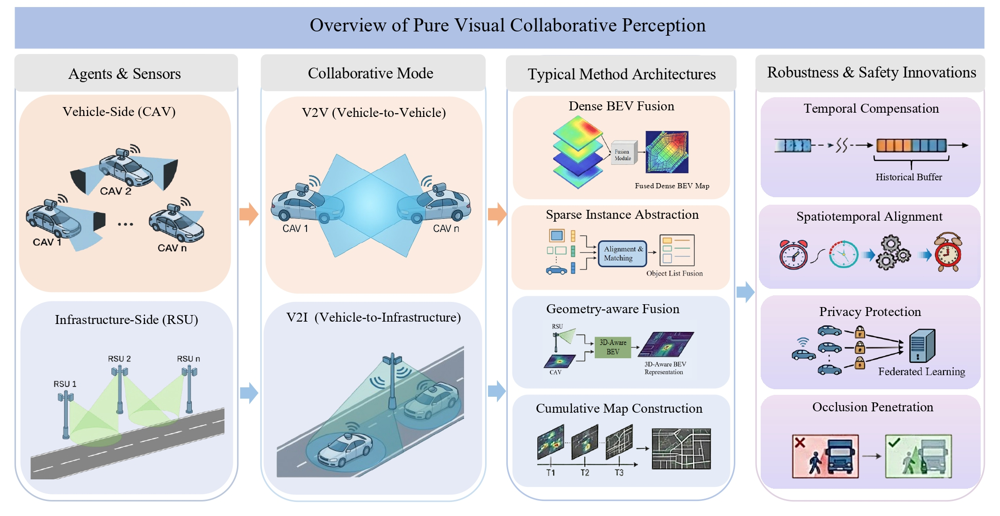

# Safe 3.0: Collaborative Perception

This repository presents a curated collection of pure visual roadside and collaborative perception systems in autonomous driving, with a focus on infrastructure-assisted sensing and multi-agent visual information sharing for safety-critical perception.

🔍Overview Vehicle-side perception is inherently constrained by limited viewpoints, occlusions, and sensing range, especially in complex traffic scenarios. Pure visual roadside and collaborative perception address these challenges by introducing infrastructure cameras and V2V/V2I cooperation, enabling broader spatial coverage, improved occlusion handling, and more robust situational awareness. To better understand these systems, Safe 3.0 is categorized into two main types:  
📌Pure Visual Roadside Perception: Uses roadside RGB, thermal, fisheye, event, multi-camera, or multimodal visual sensors to enhance traffic-scene understanding from infrastructure viewpoints.  
📌Collaborative Perception: Enables V2V and V2I visual information sharing to extend perception range, reduce blind spots, and support safer cooperative autonomous driving.

## Pure Visual Roadside Perception

Pure visual roadside perception focuses on infrastructure-mounted visual sensors for traffic-scene understanding from external viewpoints. Compared with onboard perception, roadside perception can provide more stable observation positions, wider scene-level coverage, and complementary visibility for occluded or long-range targets. This section summarizes both single-modality roadside perception using RGB, thermal, fisheye, or event cameras, and multi-modality roadside perception based on multi-camera or cross-modal visual fusion.

### Single-modality Roadside Perception

#### RGB

- Method of Multi-Lane Vehicles Speed Continuously Perceiving Based on Single Roadside Camera / [paper](https://ieeexplore.ieee.org/document/9922458) / ITSC 2022
- Camera Perspective Transformation to Bird's Eye View via Spatial Transformer Model for Road Intersection Monitoring / [paper](https://ieeexplore.ieee.org/document/10794871) / SM 2024
- Calibration-free BEV Representation for Infrastructure Perception / [paper](https://arxiv.org/abs/2303.03583) / [code](https://github.com/leofansq/CBR) / IROS 2023 / CBR
- PDDepth: Pose Decoupled Monocular Depth Estimation for Roadside Perception System / [paper](https://ieeexplore.ieee.org/document/10938119) / TCSVT 2025 / PDDepth
- MonoGAE: Roadside Monocular 3D Object Detection with Ground-Aware Embeddings / [paper](https://ieeexplore.ieee.org/document/10634585) / [code](https://github.com/HIYYJX/MonoGAE) / T-ITS 2024 / MonoGAE
- BEVHeight: A Robust Framework for Vision-based Roadside 3D Object Detection / [paper](https://arxiv.org/abs/2303.08498) / [code](https://github.com/ADLab-AutoDrive/BEVHeight) / CVPR 2023 / BEVHeight
- BEVHeight++: Toward Robust Visual Centric 3D Object Detection / [paper](https://arxiv.org/abs/2309.16179) / [code](https://github.com/yanglei18/BEVHeight_Plus) / TPAMI 2025 / BEVHeight++
- MonoCT: Overcoming Monocular 3D Detection Domain Shift with Consistent Teacher Models / [paper](https://arxiv.org/abs/2503.13743) / arXiv 2025 / MonoCT
- Height3D: A Roadside Visual Framework Based on Height Prediction in Real 3-D Space / [paper](https://ieeexplore.ieee.org/document/10945981) / T-ITS 2025 / Height3D
- HeightFormer: A Semantic Alignment Monocular 3D Object Detection Method from Roadside Perspective / [paper](https://arxiv.org/abs/2410.07758) / arXiv 2024 / HeightFormer
- CoBEV: Elevating Roadside 3D Object Detection with Depth and Height Complementarity / [paper](https://arxiv.org/abs/2310.02815) / [code](https://github.com/MasterHow/CoBEV) / TIP 2024 / CoBEV
- Accurate Representation Modeling and Interindividual Constraint Learning for Roadside Three-Dimensional Object Detection / [paper](https://ieeexplore.ieee.org/document/10804087) / TII 2024
- BEVSpread: Spread Voxel Pooling for Bird's-Eye-View Representation in Vision-based Roadside 3D Object Detection / [paper](https://arxiv.org/abs/2406.08785) / [code](https://github.com/DaTongjie/BEVSpread) / CVPR 2024 / BEVSpread

#### Thermal

- Object Detection in Thermal Spectrum for Advanced Driver-Assistance Systems (ADAS) / [paper](https://ieeexplore.ieee.org/document/9612070) / IEEE Access 2021
- Evaluation of Thermal Imaging on Embedded GPU Platforms for Application in Vehicular Assistance Systems / [paper](https://ieeexplore.ieee.org/document/9882295) / [code](https://github.com/MAli-Farooq/Thermal-YOLO) / T-IV 2022
- YOLO-Thermal: Thermal Detection of People with Mobility Restrictions for Barrier Reduction at Traffic Lights Controlled Intersections / [paper](https://arxiv.org/abs/2505.08568) / [code](https://github.com/leon2014dresden/YOLO-THERMAL) / arXiv 2025 / YOLO-Thermal
- Enhanced Detection and Recognition of Road Objects in Infrared Imaging Using Multi-Scale Self-Attention / [paper](https://www.mdpi.com/1424-8220/24/16/5404) / Sensors 2024
- LMPC2D3DCNet: Infrared Polarization-Empowered Full-Time Road Detection via Lightweight Multi-Pathway Collaborative 2D/3D Convolutional Networks / [paper](https://ieeexplore.ieee.org/document/10478185) / [code](https://github.com/XueqiangF/LMPC2D3DCNet) / T-ITS 2024 / LMPC2D3DCNet
- FlexSense: Flexible Infrastructure Sensors for Traffic Perception / [paper](https://ieeexplore.ieee.org/document/10422051) / ITSC 2023 / FlexSense

#### Fisheye

- Roadside Fisheye Vision for Cooperative Perception in V2I-Assisted Automated Driving / [paper](https://ieeexplore.ieee.org/document/10945962) / OJITS 2025
- Localization of a Smart Infrastructure Fisheye Camera in a Prior Map for Autonomous Vehicles / [paper](https://ieeexplore.ieee.org/document/9812043) / ICRA 2022
- Fast Vehicle Detection and Tracking on Fisheye Traffic Monitoring Video Using CNN and Bounding Box Propagation / [paper](https://ieeexplore.ieee.org/document/9897524) / ICIP 2022
- Low-Light Image Enhancement Framework for Improved Object Detection in Fisheye Lens Datasets / [paper](https://openaccess.thecvf.com/content/CVPR2024W/AI4CC/papers/Tran_Low-light_Image_Enhancement_Framework_for_Improved_Object_Detection_in_Fisheye_CVPRW_2024_paper.pdf) / [code](https://github.com/daitranskku/AIC2024-TRACK4-TEAM15) / CVPRW 2024
- FE-Det: An Effective Traffic Object Detection Framework for Fish-Eye Cameras / [paper](https://openaccess.thecvf.com/content/CVPR2024W/WAD/papers/Luo_FE-Det_An_Effective_Traffic_Object_Detection_Framework_for_Fish-Eye_Cameras_CVPRW_2024_paper.pdf) / CVPR 2024 / FE-Det

#### Event

- Real-Time Object and Event Detection Service Through Computer Vision and Edge Computing / [paper](https://arxiv.org/abs/2504.11662) / arXiv 2025
- Online Multi-Object Tracking-by-Clustering for Intelligent Transportation System with Neuromorphic Vision Sensor / [paper](https://link.springer.com/chapter/10.1007/978-3-319-67190-1_11) / KI 2017
- EBBINNOT: A Hardware-Efficient Hybrid Event-Frame Tracker for Stationary Dynamic Vision Sensors / [paper](https://ieeexplore.ieee.org/document/9826854) / IoT-J 2022 / EBBINNOT
- Event Camera Point Cloud Feature Analysis and Shadow Removal for Road Traffic Sensing / [paper](https://ieeexplore.ieee.org/document/9591351) / JSEN 2021
- Spiking Neural Networks for Robust and Efficient Object Detection in Intelligent Transportation Systems With Roadside Event-Based Cameras / [paper](https://ieeexplore.ieee.org/document/10186704) / IV 2023
- Edge Neuro-Statistical Learning for Event-Based Visual Motion Detection and Tracking in Roadside Safety Systems / [paper](https://iopscience.iop.org/article/10.1088/2634-4386/adb9b7) / NCE 2025
- SMamba: Sparse Mamba for Event-based Object Detection / [paper](https://ojs.aaai.org/index.php/AAAI/article/view/33211) / [code](https://github.com/Zizzzzzzz/SMamba_AAAI2025) / AAAI 2025 / SMamba

### Multi-modality Roadside Perception

#### RGB & RGB

- Real-Time Full-Stack Traffic Scene Perception for Autonomous Driving with Roadside Cameras / [paper](https://ieeexplore.ieee.org/document/9812359) / ICRA 2022
- RopeBEV: A Multi-Camera Roadside Perception Network in Bird's-Eye-View / [paper](https://arxiv.org/abs/2409.11706) / arXiv 2024 / RopeBEV
- MC-BEVRO: Multi-Camera Bird Eye View Road Occupancy Detection for Traffic Monitoring / [paper](https://arxiv.org/abs/2502.11287) / arXiv 2025 / MC-BEVRO
- Evaluation of Multi-Camera-Based Localization for Accurate Collision Risk Detection / [paper](https://ieeexplore.ieee.org/document/10757542) / VTC 2024
- Roadside Cross-Camera Vehicle Tracking Combining Visual and Spatial-Temporal Information for a Cloud Control System / [paper](https://www.emerald.com/insight/content/doi/10.26599/JICV.2023.9210028/full/html) / JICV 2024
- Multi-Camera Multi-Vehicle Tracking Guided by Highway Overlapping FOVs / [paper](https://www.mdpi.com/2227-7390/12/10/1467) / Mathematics 2024
- Experimental Study of Multi-Camera Infrastructure Perception for V2X-Assisted Automated Driving in Highway Merging / [paper](https://ieeexplore.ieee.org/document/10684587) / T-ITS 2024

#### RGB & Others

- Multi-Modal Sensor Fusion-Based Semantic Segmentation for Snow Driving Scenarios / [paper](https://ieeexplore.ieee.org/document/9467386) / [code](https://github.com/xiaodonguo/SUS_dataset) / JSEN 2021
- BMFusion: Bridging the Gap Between Dark and Bright in Infrared-Visible Imaging Fusion / [paper](https://www.mdpi.com/2079-9292/13/24/5005) / Electronics 2024 / BMFusion
- Improving RGB-Infrared Object Detection by Reducing Cross-Modality Redundancy / [paper](https://www.mdpi.com/2072-4292/14/9/2020) / Remote Sensing 2022 / RISNet
- New Generation Thermal Traffic Sensor: A Novel Dataset and Monocular 3D Thermal Vision Framework / [paper](https://www.sciencedirect.com/science/article/pii/S0950705025002588) / KBS 2025 / Thermal3D
- The Fraunhofer CCIT Smart Intersection / [paper](https://ieeexplore.ieee.org/document/9564919) / ITSC 2021
- Mixed Frame-/Event-Driven Fast Pedestrian Detection / [paper](https://ieeexplore.ieee.org/document/8793924) / ICRA 2019
- MSight: An Edge-Cloud Infrastructure-Based Perception System for Connected Automated Vehicles / [paper](https://arxiv.org/abs/2310.05290) / arXiv 2023 / MSight
- Towards Comprehensive Roadside Intelligence: Sensor Fusion and Full-Stack Perception with Multiple Cameras / [paper](https://ieeexplore.ieee.org/document/10972087) / IV 2025

## Collaborative Perception

Collaborative perception is gaining attention in autonomous driving to overcome the limits of vehicle only or infrastructure only perception, particularly in handling occlusions and extreme scenarios. By enabling information sharing among vehicles and roadside infrastructure, it expands the perception range, reduces blind spots, and improves environmental understanding. Compared to single-vehicle systems, collaborative perception enhances robustness, lowers latency, and increases safety. The following sections introduce V2V and V2I collaboration.

### V2V

* Collaboration Helps Camera Overtake LiDAR in 3D Detection / [paper](https://openaccess.thecvf.com/content/CVPR2023/papers/Hu_Collaboration_Helps_Camera_Overtake_LiDAR_in_3D_Detection_CVPR_2023_paper.pdf) / [code](https://github.com/MediaBrain-SJTU/CoCa3D) / CVPR 2023 / CoCa3D

* CoBEVT: Cooperative Bird's Eye View Semantic Segmentation with Sparse Transformers / [paper](https://arxiv.org/pdf/2207.02202) / [code](https://github.com/DerrickXuNu/CoBEVT) / CoRL 2022 / CoBEVT

* Unlocking Past Information: Temporal Embeddings in Cooperative Bird's Eye View Prediction / [paper](https://ieeexplore.ieee.org/stamp/stamp.jsp?tp=\&arnumber=10588608) / [code](https://github.com/cvims/TempCoBE) / IV 2024 / TempCoBEV

* IFTR: An Instance-Level Fusion Transformer for Visual Collaborative Perception / [paper](https://arxiv.org/abs/2407.09857) / [code](https://github.com/wangsh0111/IFTR) / CVPR 2024 / IFTR

* SmartCooper: Vehicular Collaborative Perception with Adaptive Fusion and Judger Mechanism / [paper](https://arxiv.org/abs/2402.00321) / CVPR 2024 / SmartCooper

* V2V Based Visual Cooperative Perception for Connected Autonomous Vehicles: Far-Sight and See-Through / [paper](https://ieeexplore.ieee.org/document/10588842) / IV 2024/ V2V-based

### V2I

* BEVSync: Asynchronous Data Alignment for Camera-based Vehicle-Infrastructure Cooperative Perception Under Uncertain Delays / [paper](https://ojs.aaai.org/index.php/AAAI/article/view/33611) / AAAI 2025 / BEVSync

* FedBEVT: Federated Learning Bird’s Eye View Perception Transformer in Road Traffic Systems / [paper](https://arxiv.org/abs/2304.01534) / [code](https://github.com/rruisong/FedBEVT) /IV 2023 / FedBEVT

* BEVHeight++: Toward Robust Visual Centric 3D Object Detection / [paper](https://arxiv.org/abs/2309.16179) /[code](https://github.com/yanglei18/BEVHeight_Plus) / CVPR 2023 / BEVHeight++

* A Benchmark for Vision-Centric HD Mapping by V2I Systems/ [paper](https://arxiv.org/abs/2503.23963) / IV 2025 / V2I-HD

* VI-Map: Infrastructure-Assisted Real-Time HD Mapping for Autonomous Driving / [paper](https://dl.acm.org/doi/10.1145/3570361.3613280) / [code](https://github.com/yuzehh/VI-Map) /ACM 2023 / VI-Map

* DAIR-V2X: A Large-Scale Dataset for Vehicle-Infrastructure Cooperative 3D Object Detection / [paper](https://arxiv.org/abs/2204.05575) /[code](https://github.com/AIR-THU/DAIR-V2X) / CVPR 2022 / DAIR-V2X