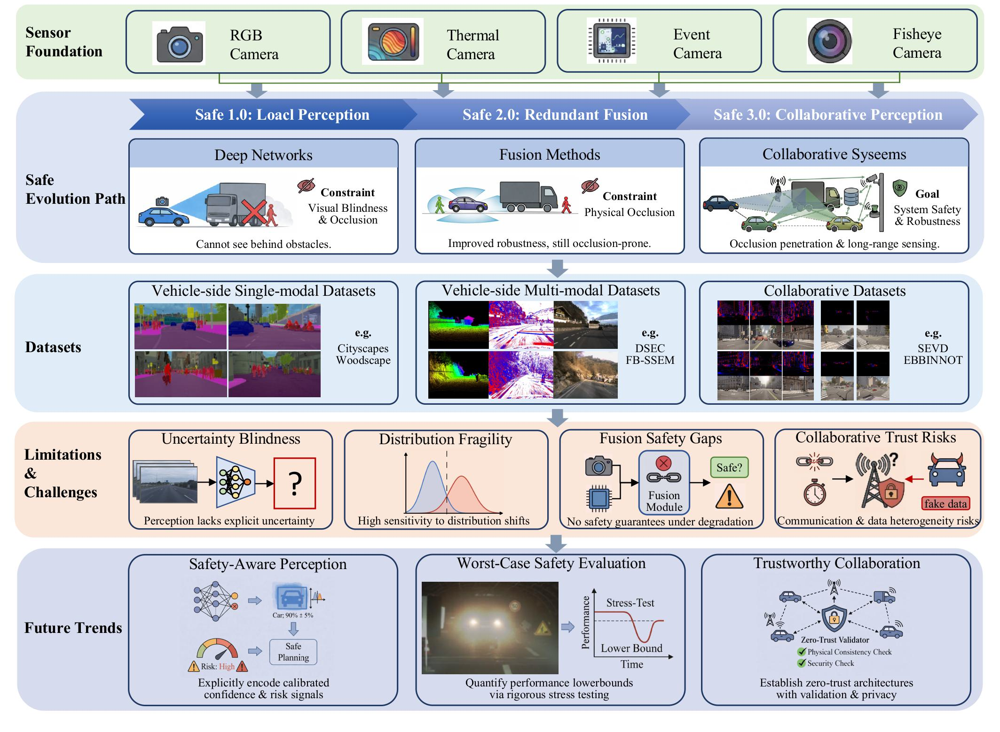

# 🛣️ SafeVision: A Safety-Centric Survey of Pure-Vision Autonomous Driving from Local Perception to Collaborative Intelligence

## 🚗 Introduction

Pure-vision perception has emerged as a scalable and cost-effective paradigm for autonomous driving, enabling environment understanding through camera-based sensing without relying on expensive LiDAR systems. However, despite remarkable advances in BEV perception, multi-camera fusion, and collaborative intelligence, current pure-vision systems still face critical safety challenges under real-world conditions, including illumination degradation, adverse weather, occlusion, long-tail scenarios, and communication uncertainty.

This repo is associated with the survey paper "SafeVision: A Safety-Centric Survey of Pure-Vision Autonomous Driving from Local Perception to Collaborative Intelligence", which provides an up-to-date literature survey for Pure-Vision Perception. We hope this repo can not only be a good starting point for new beginners but also help current researchers in the Pure-Vision Perception community.

---

## 📌 Highlights

This repository complements the survey "Pure-Vision Perception for Autonomous Driving: A Survey on Sensors, Multi-Camera Fusion, and Collaborative Systems", which categorizes Pure-vision perception into:

1. SafeBEV 1.0: Local Perception

2. SafeBEV 2.0: Redundant Perception

3. SafeBEV 3.0: Collaborative Perception

<!-- 📚 [Read the Full Survey Paper (PDF)](./纯视觉自动驾驶综述_hxx_新%20(1).pdf) -->

📌 Keywords: Autonomous driving, pure-vision perception,
safety-critical perception, multi-camera fusion, collaborative per
ception.

---

## 📌 Framework

The figure provides a comprehensive roadmap for safety-oriented perception in intelligent vehicles, illustrating the progression from single-modal perception to multi-modal and collaborative perception paradigms. It summarizes the sensor foundations, dataset taxonomies, existing safety challenges, and emerging research directions, which together establish the overall structure and motivation of the discussions presented throughout this paper.

---

## Project Overview

This project dedicated to safety-aware pure-vision autonomous driving research. Below are the main components of this project:

## 🔗 Sections

1. [Safe 1.0: Local Perception](./01_Safe1.0/Safe1.0.md)
2. [Safe 2.0: Redundant Perception](./02_Safe2.0/Safe2.0.md)
3. [Safe 3.0: Collaborative Perception](./03_Safe3.0/Safe3.0.md)

## 📝 Summary

This repository provides a safety-oriented survey of pure-vision perception for autonomous driving, organized as a three-stage framework from single-camera sensing to multi-camera fusion and collaborative perception.

**Safe 1.0 - Local Perception** focuses on RGB, thermal, event, and fisheye cameras as individual visual sensors. Representative works include Pseudo-LiDAR, CaDDN, PON, EV-FlowNet, and FisheyeYOLO. While these methods show the feasibility of single-sensor perception, they remain limited under illumination changes, adverse weather, high-speed motion, and geometric distortion.

**Safe 2.0 - Redundant Perception** improves robustness through homogeneous RGB/fisheye fusion and heterogeneous RGB-thermal or RGB-event fusion. Representative works include LSS, BEVDet, BEVDepth, PETR, CRM, RENet, and DAGr, which expand spatial coverage, reduce blind spots, and enhance perception under challenging conditions.

**Safe 3.0 - Collaborative Perception** extends perception to roadside infrastructure and V2V/V2I collaboration. Representative works include BEVHeight, BEVHeight++, CoBEVT, CoCa3D, BEVSync, VI-Map, and DAIR-V2X, enabling wider perception range, occlusion mitigation, and safer situational awareness.

Together, the three stages form a unified roadmap for safe and robust pure-vision autonomous driving.

